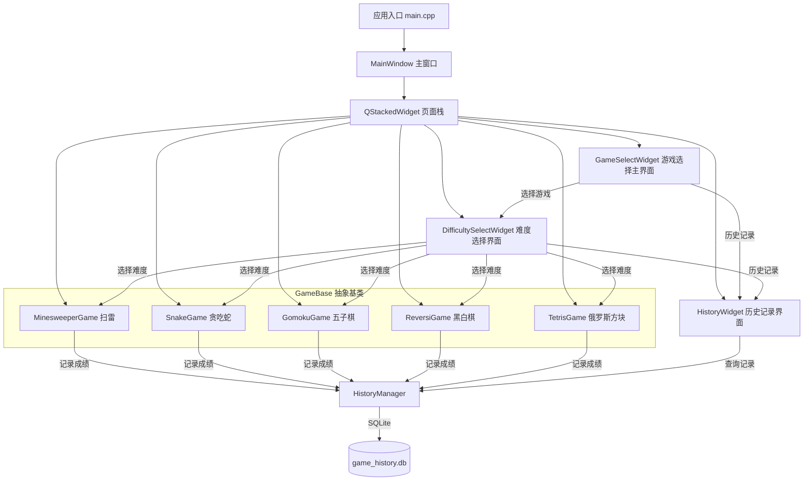
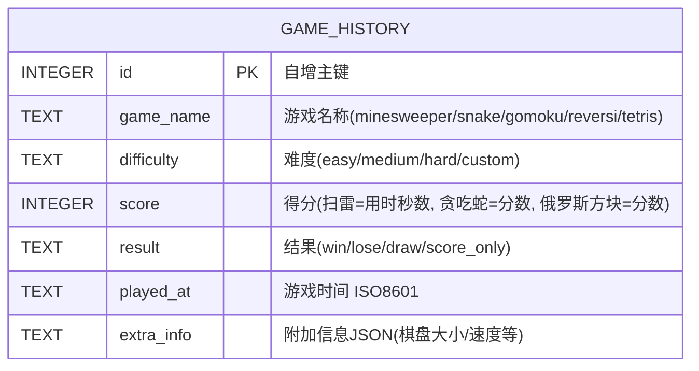

# 项目设计文档 - 游戏掌机 (Game Console)

## 1. 系统架构

## 2. 数据模型

## 3. 接口清单

本项目为纯桌面应用，无 HTTP API。核心内部接口如下：

### HistoryManager（数据层）
- `initDatabase()` — 初始化 SQLite 数据库与表结构
- `addRecord(gameName, difficulty, score, result, extraInfo)` — 新增游戏记录
- `getRecords(gameName)` — 按游戏名称查询记录
- `getAllRecords()` — 查询所有记录
- `clearRecords(gameName)` — 清除指定游戏记录

### GameBase（游戏基类）
- `startGame(difficulty)` — 以指定难度启动游戏
- `pauseGame()` / `resumeGame()` — 暂停/恢复
- `resetGame()` — 重置游戏状态
- Signal: `gameFinished(score, result)` — 游戏结束信号

## 4. 页面清单

| 页面 | 功能描述 |
|------|---------|
| 游戏选择主界面 | 水平布局：左侧控制面板(游戏列表+历史按钮)，右侧游戏图片网格按钮 |
| 难度选择界面 | 五个按钮：简单、中级、高级、自定义、历史记录 |
| 自定义难度弹窗 | 根据游戏类型显示可调参数(SpinBox/Slider) |
| 扫雷游戏界面 | 网格棋盘 + 计时器 + 剩余雷数 + 返回按钮 |
| 贪吃蛇游戏界面 | 游戏画布 + 分数显示 + 返回按钮 |
| 五子棋游戏界面 | 15x15棋盘 + 当前执子提示 + 返回按钮 |
| 黑白棋游戏界面 | 8x8棋盘 + 双方棋子计数 + 当前执子提示 + 返回按钮 |
| 俄罗斯方块游戏界面 | 游戏区 + 下一个方块预览 + 分数/等级/消行 + 返回按钮 |
| 历史记录总览 | 各游戏入口按钮列表 |
| 游戏历史详情 | 该游戏的历史记录表格(日期/难度/得分/结果) |

## 5. 示例数据规划

### SQLite 初始化示例数据
每个游戏预置 5-8 条历史记录，覆盖不同难度和结果：
- 扫雷：5 条记录（简单胜/中级胜/高级负/简单胜/中级负）
- 贪吃蛇：5 条记录（不同难度不同分数）
- 五子棋：5 条记录（黑胜/白胜交替）
- 黑白棋：5 条记录（黑胜/白胜交替）
- 俄罗斯方块：5 条记录（不同难度不同分数）

示例数据在 `database-sqlite/init.sql` 中定义，由 HistoryManager 首次启动时自动加载（检测表是否为空）。

## 6. 前端设计规范（遵循 frontend-master 标准）

### 6.1 设计方向
- 美学风格：赛博朋克 × 复古像素 融合 — 深色基调搭配霓虹色高亮，致敬经典掌机的同时赋予现代质感
- 设计关键词：霓虹暗夜、像素情怀、沉浸游戏、极简操控、赛博光泽

### 6.2 色彩体系
- 主色 (Primary): `#6366F1` (Indigo) — 按钮主色、选中态、标题强调
- 辅色 (Secondary): `#8B5CF6` (Violet) — 辅助装饰、渐变终点、hover态
- 强调色 (Accent): `#22D3EE` (Cyan) — 分数高亮、活跃状态指示、游戏内关键元素
- 背景色 (Background): `#0F172A` (Dark Navy) — 主背景色
- 表面色 (Surface): `#1E293B` (Slate 800) — 卡片/面板背景
- 表面亮色 (Surface Light): `#334155` (Slate 700) — 按钮底色、输入框
- 文字主色: `#F1F5F9` (Slate 100) — 主要文字
- 文字次色: `#94A3B8` (Slate 400) — 次要说明文字
- 边框色: `#475569` (Slate 600) — 分割线、边框
- Success: `#10B981` — 胜利、正确
- Warning: `#F59E0B` — 警告、旗帜
- Error: `#EF4444` — 失败、地雷爆炸
- Info: `#3B82F6` — 提示信息
- 60-30-10 分配：60% 深色背景 / 30% 表面色面板 / 10% 霓虹强调色

### 6.3 字体体系
- 标题字体: "Orbitron" (Google Fonts) — 科技感强的几何字体，用于游戏标题和数字显示
- 正文字体: "Noto Sans SC" (思源黑体) — 清晰的中文+英文混排
- 等宽字体: "JetBrains Mono" — 分数/计时器数字显示
- 字号阶梯: xs(12px) / sm(14px) / base(16px) / lg(18px) / xl(20px) / 2xl(24px) / 3xl(30px) / 4xl(36px)
- 行高: 正文 1.6 / 标题 1.2
- 字重: Regular(400) / Medium(500) / Semibold(600) / Bold(700)

### 6.4 间距与布局
- 基准单位: 4px
- 间距阶梯: 4 / 8 / 12 / 16 / 24 / 32 / 48 / 64 px
- 主界面布局: 水平分割 — 左侧 250px 控制面板 + 右侧自适应游戏网格
- 游戏网格: 3列×2行，间距 16px，卡片比例 4:3
- 游戏界面: 垂直居中，上方信息栏 + 中央游戏区 + 底部控制栏

### 6.5 组件规范
- 圆角: sm(4px) / md(8px) / lg(12px) / xl(16px)
- 阴影层级:
  - sm: `0 1px 3px rgba(0,0,0,0.3)`
  - md: `0 4px 12px rgba(0,0,0,0.4)`
  - lg: `0 8px 24px rgba(0,0,0,0.5)`
  - glow: `0 0 20px rgba(99,102,241,0.3)` (霓虹光晕)
- 按钮样式: 圆角 8px，高度 40px(标准)/48px(大)，hover 时带光晕阴影
- 卡片样式: 圆角 12px，背景 Surface 色，1px 边框，hover 时上移 2px + 光晕

### 6.6 动效规范
- 过渡时长: 快(150ms) / 中(250ms) / 慢(400ms)
- 缓动函数: `cubic-bezier(0.4, 0, 0.2, 1)` (Material ease)
- 页面切换: QStackedWidget 渐入渐出（通过 QPropertyAnimation opacity）
- 按钮 Hover: 背景色过渡 + 边框光晕
- 卡片 Hover: 向上偏移 2px + 增加阴影 + 边框高亮
- 游戏内动效: 方块消除闪烁、蛇身移动流畅、棋子落子缩放

### 6.7 平台适配说明
- 目标平台: Linux / macOS 桌面
- 最小窗口尺寸: 1000×700 px
- 推荐窗口尺寸: 1200×800 px
- 交互范式: 鼠标点击 + 键盘方向键(贪吃蛇/俄罗斯方块)
- 字体加载: 通过 Qt Resource System 嵌入 TTF 字体，保证跨平台一致
- 高 DPI 适配: 使用 Qt::AA_EnableHighDpiScaling

### 6.8 图片与媒体资源清单
- 游戏图标: 5 个 SVG 矢量图标（扫雷/贪吃蛇/五子棋/黑白棋/俄罗斯方块），64×64
- 功能图标: 返回箭头、历史记录、设置齿轮，24×24 SVG
- 游戏封面: 使用 QPainter 程序化绘制各游戏的预览缩略图（棋盘/蛇身/方块等），无需外部图片
- QSS 子部件图标: 下拉箭头、勾选标记，由 QPainter 在运行时绘制或使用内联 SVG
